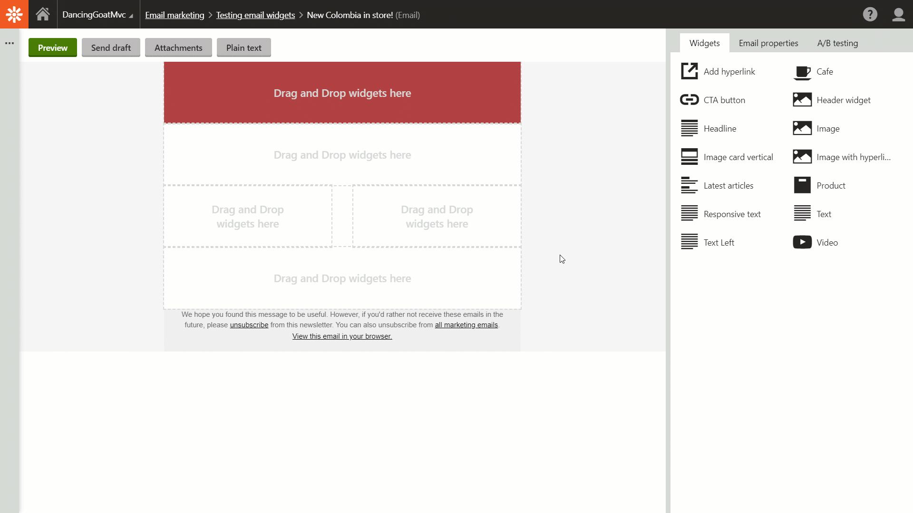

# Header image email widget
The **Header image** widget allows editors to add header image into their email.

## Installation
If you want to use the **Header image** email widget, download the .zip package and import it to your website.

1. **Sites** application > **Import sites or objects** button > 
2. In the Second step, **Select all** objects and finish the wizard.
3. Switch to the **System** application > **Macros** > **Signatures** re-sign all macros.
4. Switch to **Email marketing** application > **Email widgets** > *Header image* widget.
5. On the **Assigned to email templates** tab, add the widget to templates on which you want to use it.

See the widget in action:

 You can read also [read about the Image with hyperlink widget](https://www.kentico.com/blog/enhance-your-email-marketing-part-4-using-images-in-emails) in a short article on Kentico blog.